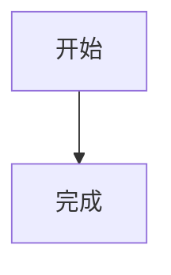

# Little Secretary

基于 Electron、Vue 3 和 Vite 的极简深色桌面聊天机器人。

## 功能

- OpenAI-compatible 模型配置，支持 Ollama、LM Studio 和兼容云服务
- 主进程代理流式输出，支持 `reasoning_content` 和 `<think>...</think>` 思考内容展示
- MCP 工具调用和 Skills 导入，默认内置 Web 资讯查询和当前时间能力
- Markdown、代码高亮、Mermaid 图和 Chart.js 图表渲染
- 受控本地文件操作，文件访问目录需要先在系统设置中授权
- 系统字体大小可在 10-20px 间按整数拖动调整

## 运行

```bash
npm install
npm run dev
```

如果 Electron 下载失败，可临时使用镜像：

```powershell
$env:ELECTRON_MIRROR='https://npmmirror.com/mirrors/electron/'
npm install
```

## 打包安装包

Windows 打包：

```powershell
$env:ELECTRON_MIRROR='https://npmmirror.com/mirrors/electron/'
$env:ELECTRON_BUILDER_BINARIES_MIRROR='https://npmmirror.com/mirrors/electron-builder-binaries/'
npm run dist:win
```

产物会生成在 `release/` 目录：

- `Little Secretary-Setup-0.1.0-x64.exe`：Windows 安装器
- `Little Secretary-Portable-0.1.0-x64.exe`：免安装版

安装器会自动创建桌面快捷方式。选择安装路径时，如果选择的是空文件夹，安装器会自动在该空文件夹下创建 `Little Secretary` 子目录，并把程序安装到这个子目录里。

如果只想检查打包后的目录结构，不生成安装器：

```bash
npm run pack
```

把安装器发给别人即可安装使用。对方电脑不需要安装 Node.js，但需要能访问你配置的模型服务：

- 使用本地 Ollama/LM Studio 时，对方也需要在自己电脑启动对应模型服务
- 使用云端 OpenAI-compatible 服务时，对方需要在设置里填 Base URL、API Key 和模型名称
- 本地文件操作默认只允许访问用户主目录，其他目录需要在系统设置中授权

## 模型配置

右上角设置按钮打开设置面板，在“模型配置”中填写：

- Base URL，例如 `http://127.0.0.1:11434/v1`
- API Key，本地兼容服务可留空
- 模型名称，例如 `qwen3:8b`
- Temperature

## 本地文件命令

页面保持一个输入框。文件操作通过输入框中的命令触发：

```text
/read C:\path\to\file.txt
/ls C:\path\to\folder
/open C:\path\to\file.txt
/write C:\path\to\file.txt
从第二行开始写入文件内容
```

默认只允许访问用户主目录。访问其他目录前，在“系统设置”里添加允许访问目录。

## MCP 与 Skills

右上角设置进入“能力扩展”：

- 默认启用 `内置基础工具`，提供 `web_search`、`fetch_page`、`get_current_time`
- 可添加自定义 MCP stdio 服务器，填写命令和参数
- 可导入包含 `SKILL.md` 的本地 Skill 目录，启用后会作为能力说明注入模型上下文

模型需要支持 OpenAI-compatible tool calling 才能主动调用 MCP 工具。若模型不支持工具调用，Skills 仍可作为提示词增强使用。

### 获取 MCP 服务器

常见来源：

- [Official MCP Registry](https://registry.modelcontextprotocol.io/) 或 [MCP Registry 文档](https://modelcontextprotocol.io/registry/about)，适合查找公开发布的 MCP server
- [modelcontextprotocol/servers](https://github.com/modelcontextprotocol/servers) 参考实现仓库，适合找官方维护的小型示例
- `npm`、`PyPI/uvx`、GitHub Release、Docker Hub 等包管理或源码仓库，通常会在 README 中给出启动命令
- 你自己写的本地 MCP server，只要支持 stdio transport 即可接入本应用
- 团队内部封装的接口服务，例如数据库、CRM、工单、搜索、文件系统等

本应用内置的 `内置基础工具` 不需要额外安装，包含：

- `web_search`：搜索当前 Web 资讯
- `fetch_page`：读取指定网页正文
- `get_current_time`：获取当前日期时间。用户说“现在”“今日”“今天”“当前”“昨天”“明天”时，模型可调用该工具获得准确时间

配置方式：

1. 先在终端确认 MCP server 能单独启动。
2. 打开应用右上角设置，进入“能力扩展”。
3. 点击“添加”，填写命令和参数。
4. 点击“保存能力配置”，再点“刷新”，工具列表能看到工具名即表示连接成功。

当前自定义 MCP 服务器支持 stdio transport；远程 MCP 服务需要通过它提供的本地 stdio 启动器或代理命令接入。

示例：

```text
命令：node
参数：C:\mcp-servers\my-server\server.js
```

```text
命令：npx
参数：-y @some/mcp-server
```

```text
命令：uvx
参数：some-mcp-server --token YOUR_TOKEN
```

如果参数里有空格，请用引号包住：

```text
命令：node
参数："C:\Users\Lunar\mcp servers\server.js" --token YOUR_TOKEN
```

生产环境给别人使用时，如果配置的是 `npx`、`uvx`、`python` 这类外部命令，对方电脑也必须安装对应运行时并能访问网络。内置 `内置基础工具` 不需要额外安装。

只安装可信来源的 MCP server。MCP 工具可能读写本地文件、访问数据库、调用公司内部系统或发送网络请求，配置前应先看清它暴露的工具、权限和环境变量。

## 图表输出

可以让模型直接输出 `chart` 代码块，也可以在输入框中使用本地命令：

```text
/chart
{"type":"bar","data":{"labels":["A","B"],"datasets":[{"label":"数量","data":[12,19]}]}}
```

Mermaid：

````markdown

````

Chart.js：

````markdown
```chart
{
  "type": "bar",
  "data": {
    "labels": ["A", "B"],
    "datasets": [{ "label": "数量", "data": [12, 19] }]
  }
}
```
````
